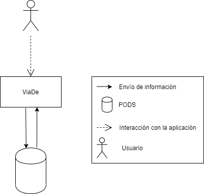

[[section-system-scope-and-context]]
== System Scope and Context

[role="arc42help"]

=== Business Context

****

El proyecto será una aplicación para que los usuarios puedan compartir sus rutas con las personas que quieran. Se utilizará la red descentralizada SOLID y se realizará usando JavaScript con el framework de ReactJS.

Los usuarios podrán guardar sus distintas rutas usando sus PODS.

[role="arc42help"]
****

=== Technical Context

[role="arc42help"]
****
TODO

****
