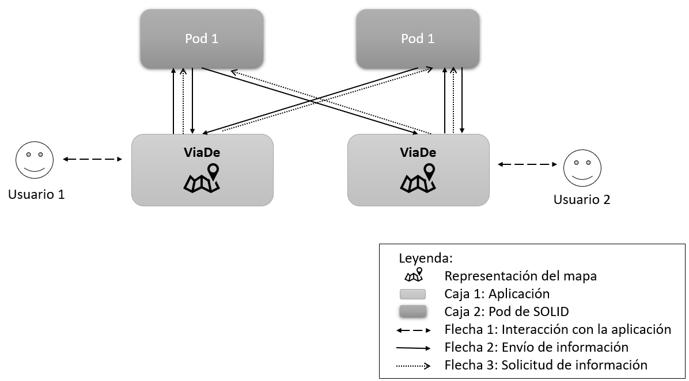

[[section-building-block-view]]

== Vista del bloque de construcción

=== Nivel 1

==== Sistema general de Whitebox

 +
Figura 5.1

|===
| **Nombre** | **Responsable de:**
| _Caja 1_ | _Aplicación encargada de cumplir con los requisitos propuestos_
| _Caja 2_ | _Pods donde se guardará la información del dueño correspondiente_
| _Flecha 1_ | _Representa la interacción del usuario con la aplicación mediante la interfaz gráfica de esta_
| _Flecha 2_ | _Representa el envío de información, bien para el guardado en el caso de apuntar a un pod o del mostrado en caso de apuntar a la aplicación_
| _Flecha 3_ | _Representa la solicitud de información desde una aplicación a un pod, ya sea el del usuario de la aplicación o de un amigo_

|===

=== Level 2

N/A

=== Level 3

N/A